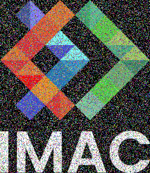
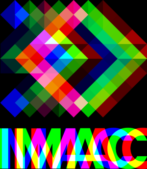
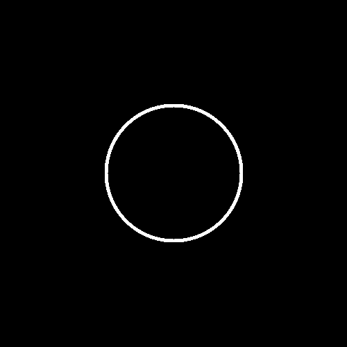
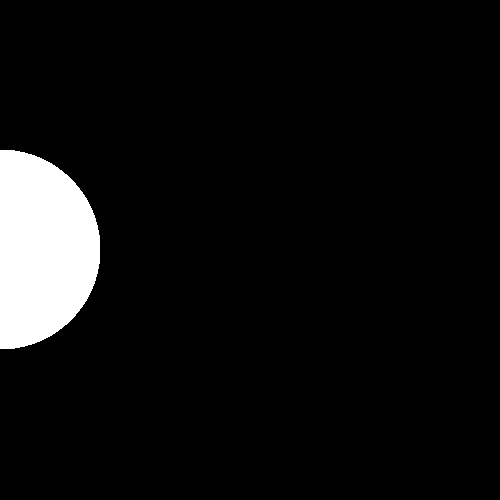
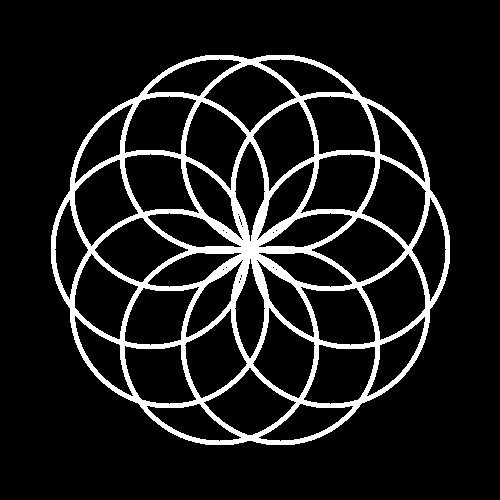
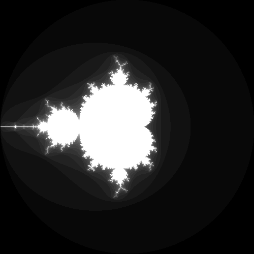
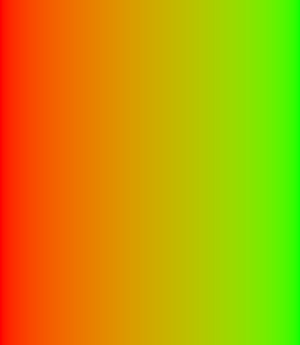
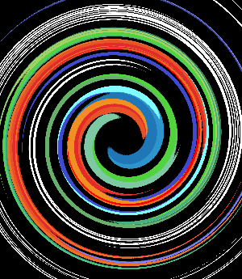
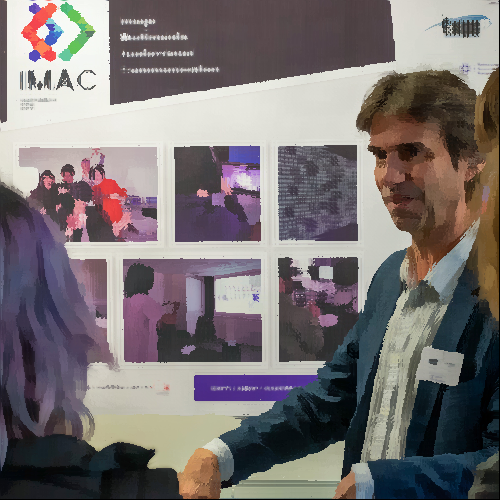

# Rendu du projet du Workshop Prog Algo
- [Rendu du projet du Workshop Prog Algo](#rendu-du-projet-du-workshop-prog-algo)
  - [Les exercices](#les-exercices)
    - [⭐ Vers Vert](#-vers-vert)
    - [⭐ Canaux échangés](#-canaux-échangés)
    - [⭐ Noir \& Blanc](#-noir--blanc)
    - [⭐ Négatif](#-négatif)
    - [⭐ Dégradé](#-dégradé)
    - [⭐⭐ Miroir](#-miroir)
    - [⭐⭐ Image bruitée](#-image-bruitée)
    - [⭐⭐ Rotation de 90°C](#-rotation-de-90c)
    - [⭐⭐ RGB Split](#-rgb-split)
    - [⭐⭐ Luminosité](#-luminosité)
      - [éclaircissement](#éclaircissement)
      - [assombrissement](#assombrissement)
    - [⭐⭐(⭐) Disque](#-disque)
    - [⭐ Cercle](#-cercle)
    - [⭐⭐ Animation](#-animation)
    - [⭐⭐⭐ Rosace](#-rosace)
    - [⭐⭐ Mosaïque](#-mosaïque)
    - [⭐⭐⭐⭐ Mosaïque miroir](#-mosaïque-miroir)
    - [⭐⭐⭐ Glitch](#-glitch)
    - [⭐⭐⭐ Tri de pixels](#-tri-de-pixels)
    - [⭐⭐⭐(⭐) Fractale de Mandelbrot](#-fractale-de-mandelbrot)
    - [⭐⭐⭐(⭐) Dégradés dans l'espace de couleur Lab](#-dégradés-dans-lespace-de-couleur-lab)
    - [⭐⭐⭐(⭐) Tramage](#-tramage)
    - [⭐⭐⭐(⭐) Normalisation de l'histogramme](#-normalisation-de-lhistogramme)
    - [⭐⭐⭐⭐ Vortex](#-vortex)
    - [⭐⭐⭐⭐ Convolutions](#-convolutions)
      - [⭐Basic Box Blur](#basic-box-blur)
      - [⭐ Emboss](#-emboss)
      - [⭐ Outline](#-outline)
      - [⭐ Sharpen](#-sharpen)
      - [⭐⭐ Optimized Box Blur](#-optimized-box-blur)
      - [⭐⭐ Différence de gaussiennes](#-différence-de-gaussiennes)
    - [⭐⭐⭐⭐⭐ K-means](#-k-means)
    - [⭐⭐⭐⭐⭐ Filtre de Kuwahara](#-filtre-de-kuwahara)

## Les exercices

### ⭐ Vers Vert

### ⭐ Canaux échangés

### ⭐ Noir & Blanc

### ⭐ Négatif

### ⭐ Dégradé

### ⭐⭐ Miroir

### ⭐⭐ Image bruitée

### ⭐⭐ Rotation de 90°C

##### Leçons
Comprendre dans quel sens tourné, c'est pas mal.

### ⭐⭐ RGB Split

##### Leçons
Comprendre qu'il faut mettre les nouvelles couleurs sur une nouvelle image évite de balancer tout le rouge très loin.

### ⭐⭐ Luminosité

#### éclaircissement

#### assombrissement

### ⭐⭐(⭐) Disque

### ⭐ Cercle

### ⭐⭐ Animation

### ⭐⭐⭐ Rosace

##### Leçons
j'aime pos la trigo.

### ⭐⭐ Mosaïque

### ⭐⭐⭐⭐ Mosaïque miroir

### ⭐⭐⭐ Glitch

### ⭐⭐⭐ Tri de pixels

### ⭐⭐⭐(⭐) Fractale de Mandelbrot

### ⭐⭐⭐(⭐) Dégradés dans l'espace de couleur Lab

###### Leçons

Travailler avec différents espaces de couleurs est fort intéressant.

### ⭐⭐⭐(⭐) Tramage

### ⭐⭐⭐(⭐) Normalisation de l'histogramme

### ⭐⭐⭐⭐ Vortex

### ⭐⭐⭐⭐ Convolutions
#### ⭐Basic Box Blur

#### ⭐ Emboss

#### ⭐ Outline

#### ⭐ Sharpen

#### ⭐⭐ Optimized Box Blur

#### ⭐⭐ Différence de gaussiennes

### ⭐⭐⭐⭐⭐ K-means

###### Leçons

Participer à une discussion sur Coollab en même temps est pas forcément une bonne idée.

### ⭐⭐⭐⭐⭐ Filtre de Kuwahara

